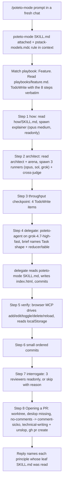

# 01. Anatomy of `/poteto-mode`

This page explains the mechanism before the trace. Every claim here is read from the installed plugin files, not from the articles. Paths are relative to the installed plugin root:

```text
C:\Users\Admin\.cursor\plugins\cache\cursor-public\pstack\4e5b1cf2ccb0ea3716f08c8ee0a5856b5ab93536\
```

Plugin version observed: `0.15.10` (from `.cursor-plugin/plugin.json`, author Lauren Tan). Public copy: https://github.com/cursor/plugins/tree/main/pstack

## 1. What gets installed

`plugin.json` registers two directories:

| key | path | what it contributes |
|---|---|---|
| `skills` | `./skills/` | 51 skill folders, each with a `SKILL.md`. 24 are `principle-*` leaf skills. The rest are workflow skills (`poteto-mode`, `how`, `architect`, `arena`, `interrogate`, `no-comments`, `unslop`, `technical-writing`, `swarm`, `figure-it-out`, ...). |
| `agents` | `./agents/` | Two subagent definitions: `poteto-agent.md` and `comment-sicko.md`. These appear as `subagent_type` values for the `Task` tool. |

Nothing runs at install time. A skill enters the model's context only when it is attached.

## 2. How a skill gets attached

Every `SKILL.md` starts with YAML frontmatter. The flags that matter for loading:

```yaml
# skills/poteto-mode/SKILL.md
name: Poteto Mode
disable-model-invocation: true   # the model may not auto-load it from its description
mode: true                       # can be used as a Custom Mode (Alt+Enter), stays in context every turn
reminder: New task? Playbook match or rigor needed -> apply /poteto-mode. ...
```

`disable-model-invocation: true` is on `poteto-mode`, `how`, `architect`, `arena`, `interrogate`, `no-comments` and every `principle-*`. That is why none of them show up in an ordinary chat: they load only when the user types the slash command or when `poteto-mode` tells the model to open the file. The hook event that proves a load is `beforeReadFile` on the `SKILL.md` path (the `Read` tool), or a `rule` / `file` attachment on `beforeSubmitPrompt` for the slash-command attach.

`/setup-pstack` is different. It writes a rule, not a skill:

```text
~/.cursor/rules/pstack-models.mdc     alwaysApply: true
```

Because it is `alwaysApply`, that rule is in every chat's context, including this tracing chat. Its current content on this machine:

```text
feature, refactoring: grok-4.7-high-fast
bug-fix: grok-4.7-high-fast
perf-issue: grok-4.7-high-fast
hillclimb: grok-4.7-high-fast
judgment and prose: claude-opus-5-5-medium
hardest tasks: claude-opus-5-5-medium
how explorer: grok-4.7-high-fast
how explainer: claude-opus-5-5-medium
why investigators: grok-4.7-high-fast
why synthesizer: claude-opus-5-5-medium
reflect tooling: gpt-5.6-sol-medium
reflect judgment, divergent, synthesizer: claude-opus-5-5-medium
arena runners: claude-opus-5-5-medium, gpt-5.6-sol-medium, grok-4.7-high-fast
arena cross-judge pool: claude-opus-5-5-medium, gpt-5.6-sol-medium, grok-4.7-high-fast
swarm workers: grok-4.7-high-fast
architect runners: claude-opus-5-5-medium, gpt-5.6-sol-medium, grok-4.7-high-fast
interrogate reviewers: claude-opus-5-5-medium, gpt-5.6-sol-medium, grok-4.7-high-fast
```

Each workflow skill names the line it reads. `how` reads `how explainer`, `architect` reads `architect runners`, `interrogate` reads `interrogate reviewers`, and the Feature playbook reads `feature, refactoring`. A panel line with three entries means three subagents.

## 3. The four routing tables inside `poteto-mode/SKILL.md`

The file is a router. It holds almost no procedure of its own. It has four tables that point at other files.

### 3.1 Non-negotiables (trigger -> skill)

A list of "if X then open skill Y" rules. The ones a Feature task hits:

| trigger text in SKILL.md | skill it routes to |
|---|---|
| "Nontrivial change, architecture decision" | `how` |
| "Any code -> name the data shape first" | `principle-model-the-domain` |
| "Code crossing a function boundary" | `architect` |
| "Contested design" | `interrogate` |
| "Nontrivial multi-step -> write the throughput checkpoint" | Feature step 3 |
| "Any prose surface -> unslop. Your reply is a prose surface." | `unslop` |
| "Docs, RFCs, readmes, PR descriptions, or commit messages" | `technical-writing` |
| "Before commit" | `/deslop` from `cursor-team-kit` (not installed here) |
| "Before review" | `no-comments` |
| "Shipping UI" | `control-ui` from `cursor-team-kit` (not installed here) |
| "Broken skill mid-task -> fix it in its own PR. Don't block. Don't silently work around it." | governs what happens at the two missing skills above |

### 3.2 Principles (index -> 24 leaf files)

An inline index with one line per principle: name, folder, and when it applies. The rule attached to it:

> Read the leaf skill in full for any principle you apply. ... Cite only principles whose leaf SKILL.md you read this session.

So a principle citation in the final reply must be preceded by a `beforeReadFile` on `skills/principle-<name>/SKILL.md`. That is the check the trace report runs.

Grouped as the file groups them:

- Core: laziness-protocol, foundational-thinking, redesign-from-first-principles, attack-the-premise, subtract-before-you-add, minimize-reader-load, outcome-oriented-execution, experience-first, exhaust-the-design-space, build-the-lever
- Architecture: model-the-domain, boundary-discipline, type-system-discipline, make-operations-idempotent, migrate-callers-then-delete-legacy-apis, separate-before-serializing-shared-state
- Verification: prove-it-works, fix-root-causes, sequence-verifiable-units, test-behavior-not-implementation, explain-the-number
- Delegation: guard-the-context-window, never-block-on-the-human
- Meta: encode-lessons-in-structure

### 3.3 Subagents

- Any subagent spawned inside a playbook step uses `subagent_type: "poteto-agent"`. `agents/poteto-agent.md` is nine lines: it tells the subagent to read `poteto-mode/SKILL.md` in full first, then do the work. So a code delegate re-reads the router and the principle index before writing code.
- Routed skills (`how`, `interrogate`, `arena`, `architect`) set their own `subagent_type` (`generalPurpose`) and their own model line. `poteto-mode` tells the model not to override those.
- Defaults for every `Task` call: `run_in_background: true`, explicit `model` per role from the rule above.
- "You own every subagent's work. Review the diff and write your own summary."
- Fresh subagent per round. Resume only when state lives in the old agent (its checkout, a running dev server).

### 3.4 Playbooks (task kind -> `playbooks/*.md`)

Twenty-three files under `playbooks/`. The instruction is mechanical:

> Open a todolist whose first items are the matched playbook's steps, copied in verbatim, before any task-specific todos. A step you choose not to do stays in the list with a one-line `skip: <reason>`.

The hook event that proves this is `preToolUse` with `tool_name: TodoWrite`; the `todos` array should contain the playbook's steps word for word. The trace report prints every TodoWrite payload for this reason.

## 4. The Feature playbook, step by step

`playbooks/feature.md` is 20 lines. Its header rule: "You own the design. Plan, review, verify. Delegate implementation. Stay in the lead." The steps, with the file each one opens and the subagents it should spawn under the current rule:

| step | text (abridged) | opens | spawns |
|---|---|---|---|
| 1 | `how` over the affected subsystem | `skills/how/SKILL.md` | Simple path: one `generalPurpose` explainer, model `how explainer` = `claude-opus-5-5-medium`, readonly. Complex path: 2-4 explorers on `grok-4.7-high-fast` first. |
| 2 | `architect` for parallel design exploration | `skills/architect/SKILL.md`, then `skills/arena/SKILL.md` | Phase B runs `arena` with the `architect runners` line: 3 runners (opus, sol, grok), then 1 cross-judge from the pool. Architect requires at least two structurally distinct candidates. |
| 3 | Write the throughput checkpoint as four todo items | nothing new | none. Four `TodoWrite` items: blocking first steps, independent workstreams, shared mutable state, smallest safe decomposition. Each keeps its item even as `n/a: <reason>`. |
| 4 | Delegate code-writing to a subagent using the configured feature model | `skills/principle-model-the-domain/SKILL.md` (the brief must name the data shape and its organizing structure) | One `poteto-agent` on `grok-4.7-high-fast` (the `feature, refactoring` line). The delegate reads `poteto-mode/SKILL.md` first. "Mandatory: no skip-with-reason escape." |
| 5 | Verify on the matching surface | `principle-prove-it-works` | For a web page: the Cursor browser (`cursor-ide-browser` MCP, visible as `beforeMCPExecution` events) or a script that drives the page. "Inconclusive or wrong-surface is not a pass." |
| 6 | Rebase into small, ordered commits | `principle-sequence-verifiable-units` | git commands, visible as `beforeShellExecution`. |
| 7 | If the design is contested, `interrogate` before shipping | `skills/interrogate/SKILL.md` | 3 `generalPurpose` reviewers, one per `interrogate reviewers` entry, readonly. May be skipped with `skip: <reason>` if the design is not contested. |
| 8 | Run Opening a PR | `playbooks/opening-a-pr.md` | see below |

Reply contract for Feature: "what you built, what you chose and why, the throughput checkpoint, open decisions. Tables for design alternatives."

## 5. Opening a PR

`playbooks/opening-a-pr.md` is invoked at the end of every other playbook. What it demands and what evidence each demand leaves:

| demand | evidence in the trace |
|---|---|
| Work from a git worktree off main | `git worktree add ...` in shell commands |
| Commit liberally, then rebase into small ordered commits | `git commit`, `git rebase -i` or equivalent |
| Run `/deslop` from `cursor-team-kit` before commit | not installed here. Expect either a `postToolUseFailure`, a failed `Read` of a deslop path, or a sentence in the reply that names the missing skill. Working around it silently would break the "broken skill" rule. |
| Run `/no-comments` before review | `beforeReadFile` on `skills/no-comments/SKILL.md`, then `subagentStart` with `subagent_type: comment-sicko` (or the display name `Comment Sicko`) |
| Write PR title, description and commit body with `/technical-writing`, then `/unslop` | `beforeReadFile` on both SKILL.md files |
| Conventional Commits title `type(scope): subject` | the `gh pr create --title` argument |
| Open ready, never draft | `gh pr create` without `--draft`; `gh pr view` before referring to status |
| Forge: `gh` by default, `origin` CLI if present | `command -v origin` or a PowerShell equivalent in shell commands |
| Do not babysit after opening | no polling loop after the PR URL |

## 6. Predicted call graph for this run



Things this prediction cannot know in advance, which the trace will settle:

1. Does `how` take the simple path (one explainer) or the complex path (explorers first) for a repo that holds only a README?
2. Does `architect` skip Phase A grounding ("skip only when the work is genuinely greenfield")? This repo is greenfield.
3. Does `architect` really fan out three runners for a one-file app, and does `arena` give each a worktree or a temp dir?
4. Which model slugs does the `Task` tool accept? The rule names `claude-opus-5-5-medium`, `gpt-5.6-sol-medium`, `grok-4.7-high-fast`. The hook's `subagent_model` field shows what actually ran.
5. How many `principle-*` leaf files does the root read, and does the delegate read more?
6. What happens at `/deslop` and `control-ui`, which are not installed.
7. Is step 7 run or skipped, and with what reason?
8. How many turns does the whole run take, and how many times does the root `TodoWrite`?

## 7. What the tracer captures

`.cursor/hooks.json` subscribes `node .cursor/hooks/trace.mjs` to every agent hook event. Each event is one JSON line in `.poteto-trace/events.jsonl` (gitignored). Large payloads are trimmed (file contents become a length, shell output and thinking text are capped at 4000 chars). The script always answers `allow` and never blocks.

Events and what they prove:

| event | proves |
|---|---|
| `beforeSubmitPrompt` | the exact prompt and which rules/files were attached (the slash-command attach) |
| `beforeReadFile` | every SKILL.md, playbook, reference and principle file the model opened, in order, per conversation |
| `preToolUse` `TodoWrite` | the playbook steps copied into the todo list, and the throughput checkpoint |
| `preToolUse` `Task` | the requested `subagent_type`, `model`, `run_in_background`, description |
| `subagentStart` | the model that actually ran (`subagent_model`), the brief (`task`) |
| `subagentStop` | status, duration, tool count, `child_conversation_id` (links the child's own events), `agent_transcript_path` |
| `beforeShellExecution` / `afterShellExecution` | git, gh, node commands and their duration |
| `beforeMCPExecution` | browser-driven verification calls |
| `afterFileEdit` | which agent edited which file |
| `afterAgentResponse` | the reply text, where principle citations live |
| `postToolUseFailure` | missing skills, rejected model slugs, failed commands |

`tools/trace-report.mjs` turns the JSONL into `timeline.md` for one root conversation plus its subagents. Page 03 is written from that output.
