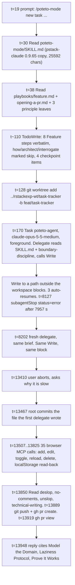

# 03. What actually happened: the traced `/poteto-mode` Feature run

Result: [PR #1, `feat(tracker): add single-page task tracker in index.html`](https://github.com/rdpatilds/rstackexp/pull/1), branch `feat/task-tracker`, one commit `c0068ec`, 182-line `index.html`.

Evidence sources, all in this repo or the Cursor project folder:

| source | path | what it holds |
|---|---|---|
| hook log slice | [`trace/run-events.jsonl`](trace/run-events.jsonl) | 356 hook events for the root chat and its two delegate conversations |
| timeline | [`trace/timeline.md`](trace/timeline.md) | the same events rendered by `tools/trace-report.mjs` |
| root transcript | `~/.cursor/projects/d-Experiments-rstackexp/agent-transcripts/1fddafc6-.../1fddafc6-....jsonl` | 61 lines, every tool call and visible thought of the root agent |
| delegate transcripts | `.../1fddafc6-.../subagents/e641c151-....jsonl`, `.../subagents/e12a58b3-....jsonl` | 4 lines each, both cut off at the hang |

Times below are `t=` seconds from `sessionStart` (11:41:08 UTC, 17:11 IST). The whole run lasted 13948 s (3 h 52 min). The implementation itself accounts for about 25 minutes of that. Section 5 explains the other 3 h 27 min.

## 1. One-screen summary



## 2. Stage by stage

### Stage 0. Which `poteto-mode` loaded

Predicted: the Cursor plugin copy at `~/.cursor/plugins/cache/cursor-public/pstack/.../skills/poteto-mode/SKILL.md` (v0.15.10).

Observed: `beforeReadFile` at t=29.8 on `C:\Users\Admin\.claude\plugins\cache\pstack-claude\pstack\0.9.65\skills\poteto-mode\SKILL.md` (25592 chars). The `beforeSubmitPrompt` event carried no attachments, so the slash command did not inject the file. The model opened it itself. Its first visible thought (root transcript line 2):

> The user triggered /poteto-mode, which should route to a fresh poteto-agent for this task. Let me check the poteto-mode skill for details before proceeding.

Why the Claude Code port won: the Cursor plugin's `poteto-mode` has `disable-model-invocation: true` and `mode: true`, so it is hidden from the skills list the model sees. The pstack-claude copy under `~/.claude/plugins` has no such flag, so it is the only `poteto-mode` the model can see by name. The two copies differ in ways that shaped this run (sections 2.4 and 6).

### Stage 1. Playbook match and principle index

Trigger (SKILL.md, Playbooks section): "Match the task to a playbook below, open its file, and copy its steps in verbatim."

Observed at t=37.9 to t=39.7, one parallel batch of six reads (root transcript line 3):

| file | why it was opened |
|---|---|
| `playbooks/feature.md` | new behavior = Feature |
| `playbooks/opening-a-pr.md` | "Invoked at the end of every other playbook", and the prompt asked for a PR |
| `principle-model-the-domain/SKILL.md` | Non-negotiable "Any code -> name the data shape first" |
| `principle-laziness-protocol/SKILL.md` | principle index, "sizing a diff" |
| `principle-prove-it-works/SKILL.md` | principle index, "before declaring done" |
| Shell `git status; ls .agents/playbooks; ls .claude/skills ...` | the pstack-claude SKILL.md adds a "Project playbooks under `.agents/playbooks/`" rule; the root checked for one |

The model named five principles in that thought ("modeling the domain, the laziness protocol, proving it works, foundational thinking, and building the lever") but opened only three. The final reply cites exactly those three. That is the "cite only principles whose leaf SKILL.md you read this session" rule holding.

### Stage 2. The todo list

Trigger: "Open a todolist whose first items are the matched playbook's steps, copied in verbatim ... A step you choose not to do stays in the list with a one-line `skip: <reason>`."

Observed (root transcript line 6, `CallDynamicTool` -> `TodoWrite`, `merge: false`). The hook log has no `TodoWrite` event. `TodoWrite` is a Cursor-native tool reached through `CallDynamicTool`, and `preToolUse` does not fire for it. This chat confirmed that: my own TodoWrite calls are absent from my hook events too. The transcript is the evidence here. The list, abridged:

```text
f1  1. `how` over the affected subsystem. skip: repo has no subsystem to walk, only README plus unrelated hook-tracing tooling   [completed]
f2  2. `architect` for parallel design exploration. skip: one file, one data shape (Task[] + editingId), conventional render-from-state; design owned inline in the delegate brief   [completed]
f3  3. Write the throughput checkpoint as four todo items.   [in_progress]
f3a   Blocking first steps: create worktree + branch feat/task-tracker, write brief with data shape, before any delegate runs
f3b   Independent workstreams: n/a, single file index.html, one delegate
f3c   Shared mutable state: delegate holds the worktree exclusively; parent does not write there until the delegate returns
f3d   Smallest safe decomposition: one worker, because the whole deliverable is one ~150-line file and splitting would serialize on the same file
f4  4. Delegate code-writing to a subagent using your configured feature model with a specific scope (...). Give every file-writing delegate its own worktree.   [pending]
f5  5. Verify on the matching surface. Drive add, edit, toggle, delete, reload in the real browser and read localStorage after each
f6  6. Rebase into small, ordered commits. Stack follow-ups.
f7  7. If the design is contested, `interrogate` before shipping. skip: design uncontested
f8  8. Run Opening a PR: /deslop, /no-comments, /technical-writing + /unslop on title/body, gh pr create (not draft)
```

Steps 1, 2 and 7 were skipped with reasons in the list, as the rule requires. Steps 3's four checkpoint items are present, two of them as `n/a`.

### Stage 3. Steps 1 and 2: `how` and `architect` were skipped

Predicted: `how` spawns one explainer, `architect` runs `arena` with three runners and a cross-judge.

Observed: neither skill file was opened, no subagent was spawned for them. The root's reasoning (transcript line 4):

> Since the subsystem is essentially empty aside from the README, running "how" over it would likely be a trivial exercise. For the architect step, this task is simple enough ... that I'll skip the parallel design exploration with a documented reason, since the design space isn't really contested.

`architect/SKILL.md` itself allows the first skip ("Skip Phase A only when the work is genuinely greenfield"), but not the second: Phase B says "Require at least two structurally distinct candidates before synthesis, even when the first looks sufficient." The root never opened `architect/SKILL.md`, so it decided from the playbook line alone. This is the largest deviation from the written procedure in the run.

What replaced it: the root designed the data shape inline. The design appears in its thinking (transcript line 6) and then verbatim in the delegate brief:

```js
// Task = { id: string, title: string, done: boolean }
// tasks: Task[]          persisted under localStorage key 'tasks' as JSON
// editingId: string|null  UI-only, never persisted; at most one row edits at a time
```

plus the organizing structure: pure functions `addTask`, `renameTask`, `toggleTask`, `removeTask` feeding one `commit()`, a full re-render, `load()` as the only boundary guard, one delegated listener. This is the Model the Domain principle applied at the brief, before any code was written, which is what Feature step 4 asks for.

### Stage 4. Step 4: delegation

Trigger (feature.md step 4): "Delegate code-writing to a subagent using your configured feature model ... Mandatory: no skip-with-reason escape."

Observed, `preToolUse Task` at t=169.1 and `subagentStart` at t=169.7:

| field | value | source |
|---|---|---|
| `subagent_type` | `poteto-agent` | both events |
| `model` requested | `claude-opus-5-5-medium` | Task tool_input |
| `subagent_model` | `claude-opus-5-5-medium` | subagentStart |
| `run_in_background` | `false` | Task tool_input |
| brief length | 4.6 KB, 11 sections | subagentStop `task` |

Two departures from the plan, both explained in the transcript:

1. Model. Your `~/.cursor/rules/pstack-models.mdc` says `feature, refactoring: grok-4.7-high-fast`. The pstack-claude SKILL.md instead says `feature, refactoring: opus` and tells the model to look for an override sheet named `pstack-models.md`. The root ran `Glob pstack-models.md` under `~/.claude` and `~/.cursor` (transcript line 5), found nothing (the Cursor file ends in `.mdc`), and concluded "Since there's no override sheet, I'll go with defaults, mapping `opus` to the latest opus model." The rule file that `/setup-pstack` wrote was in context the whole time but the skill text pointed at a different filename.
2. Foreground. SKILL.md says `run_in_background: true` for every Task. The root chose `false`: "I'm deciding to run the delegate blocking instead, simpler and keeps the turn coherent" (line 8). This choice is what later turned a stuck subagent into a stuck chat.

The brief itself is a good specimen of what the playbook means by "specific scope": worktree path and branch, the decided data shape, a DOM contract ("I will drive this in a browser, keep these exact"), code rules (120 to 180 lines, no classes, `textContent` only, comment policy), a smoke-test instruction, a commit message, and a four-item return format under 25 lines.

### Stage 4b. Inside the delegate

`agents/poteto-agent.md` tells the subagent to read `poteto-mode/SKILL.md` in full first. Observed in conversation `e641c151`:

| t | event |
|---|---|
| 174.8 | `beforeReadFile` `poteto-mode/SKILL.md` (same 25592-char pstack-claude copy) |
| 176.0 | Shell `cd worktree; git status; git branch; ls` |
| 192.8 | `beforeReadFile` `principle-boundary-discipline/SKILL.md` ("since load is the only guard there") |
| 192.8 | `beforeReadFile` `~/.claude/skills/synced/.../built-in-browser/SKILL.md` (the brief said "read the built-in-browser skill if the environment lists one") |
| 211.2 | Read `index.html` -> File not found (checking before creating) |
| 211.8 | `preToolUse Write D:\Experiments\rstackexp-wt\task-tracker\index.html` |

The delegate's transcript shows it reasoning through a real edge case before writing: "saving on Enter triggers a re-render that removes the input, which fires blur and causes a duplicate save. I need to guard against this by ignoring the save if editingId no longer matches." That reasoning survived into the committed file as its one explanatory comment (`index.html` line 136):

```js
// Re-rendering removes the focused input, which fires focusout; clearing editingId first makes that second save a no-op.
function finishEdit(input) {
  if (editingId === null) return;
```

Then nothing. No `afterFileEdit`, no `postToolUse`. See section 5.

### Stage 5. Step 5: verification on the real surface

Trigger: "Verify on the matching surface. 'Inconclusive' or wrong-surface is not a pass." Principle read: prove-it-works.

Observed, all by the root after it took over, t=13507 to t=13825, 35 `beforeMCPExecution` events on `cursor-ide-browser`:

| what | tool calls | stored value read back |
|---|---|---|
| open `file://` URL, then write a 14-line Node static server to `%TEMP%` and serve `127.0.0.1:8765` | `browser_navigate` x2, Write, Shell | |
| lock tab, read storage, find a stale task from the delegate's smoke test, clear it, reload | `browser_lock`, `browser_cdp` x2, `browser_navigate` | `null` after clear |
| add "Write the PR" (Enter did not submit, see below), add via button, add "Buy milk" | `browser_type` x2, `browser_click` x2, `browser_cdp` | two tasks, `done:false` |
| edit "Buy milk" -> "Buy oat milk" with Enter | `browser_click`, `browser_type`, `browser_cdp` | title changed |
| toggle "Write the PR" | `browser_click`, `browser_cdp`, screenshot | `done:true` |
| reload | `browser_navigate`, `browser_cdp` | `navType: navigate`, stored unchanged, rendered rows match |
| delete "Write the PR" | `browser_click`, `browser_cdp`, screenshot | one task left |
| blank submit ignored, `form.requestSubmit()` adds | `browser_cdp` | |
| Escape discards edit text | `browser_click`, `browser_type`, `browser_press_key`, `browser_cdp` | `editOpen:false`, stored unchanged |
| toggle done and back | `browser_snapshot`, `browser_click` x2, `browser_cdp` | |
| clear storage, unlock, stop server | `browser_cdp`, `browser_lock`, Shell | |

One finding the trace shows the agent handling honestly rather than papering over: `browser_type` with `submit:true` did not add a task (t=13609, then the check at t=13620 showed `rows: 0`). The root reasoned that synthetic Enter is not a trusted event and does not trigger implicit form submission, verified the button path with a real click, and later proved the Enter path with `form.requestSubmit()`. The reply reports this as a caveat with the measured facts, which is the "every claim carries its evidence or its label" rule from Writing the reply.

### Stage 6. Step 6: commits

Observed: one commit at t=13467, `feat(tracker): add single-page task tracker in index.html`, Conventional Commits form as Opening a PR requires. The todo update says "6. Rebase into small, ordered commits. One commit, already minimal". A single new file does not decompose further.

### Stage 7. Step 7: `interrogate`

Skipped in the todo list with `skip: design uncontested`. `interrogate/SKILL.md` was never read and no reviewer subagents were spawned. The predicted three-reviewer panel did not happen.

### Stage 8. Step 8: Opening a PR

Trigger: `playbooks/opening-a-pr.md`, read at t=37.9. Observed, in order:

| t | event | playbook demand it satisfies |
|---|---|---|
| 128.4 | `git worktree add D:\Experiments\rstackexp-wt\task-tracker -b feat/task-tracker main` | "Work from a git worktree off main" (first attempt at t=120 failed on `&&` in PowerShell 5, fixed with `;`) |
| 13850.6 | Read `deslop/SKILL.md` (719 chars) | "Run `/deslop` ... before commit". The pstack-claude copy ships `deslop`, so the predicted "missing skill" event did not occur. Applied by hand: "nothing to cut". |
| 13851.5 | Read `no-comments/SKILL.md` | "Run `/no-comments` before review". The skill says spawn Comment Sicko. The root did not: "after losing 87 minutes to one subagent I reviewed the two comments by hand instead." Reported as a skip in the reply. |
| 13851.9 | Read `unslop/SKILL.md` | "then apply `/unslop`" |
| 13866.8 | Read `technical-writing/SKILL.md` | "Write every PR title, PR description, and commit body with `/technical-writing`" |
| 13880.7 | Write `%TEMP%\tracker-pr-body.md` | the PR body, sections `## Why`, `## What changed`, `## Scope`, `## Tradeoffs`, `## Blast Radius`, `## Verification`, in the order the playbook lists them |
| 13889.3 | `git push -u origin feat/task-tracker; gh pr create --repo rdpatilds/rstackexp --base main --head feat/task-tracker --title "feat(tracker): ..." --body-file ...` | forge `gh`, no `--draft` |
| 13918.9 | `gh pr view 1 --json state,isDraft,url,...` | "Run `gh pr view` before you refer to PR status" |

No babysit loop followed the PR URL, as the playbook requires.

### Stage 9. The reply

The `afterAgentResponse` event at t=13948 holds the full reply. Checked against the Writing the reply rules and the Feature reply contract:

| rule | met | evidence |
|---|---|---|
| name each principle that shaped a decision and the choice it changed | yes | "Per Model the Domain, the shape is `Task = { id, title, done }` ... Per Laziness Protocol, no classes, no per-row listeners ... Per Prove It Works, I read the actual stored value after every step" |
| cite only principles whose leaf was read | yes | exactly the three files read at t=38 to 40 |
| frame impact for consumer and maintainer | yes | "What a user gets" paragraph, then "The next engineer inherits one 182-line file with one data shape and one write path" |
| throughput checkpoint | yes | its own paragraph |
| skipped steps with reasons | yes | `how`, `architect`, `interrogate`, `no-comments` subagent, each with a reason |
| every claim carries evidence or a label | yes | stored JSON quoted per step; the delegate stall cause labelled "the cause is a guess" |
| no long dash | yes | none in the text |
| PR link in full form | yes | `https://github.com/rdpatilds/rstackexp/pull/1` |

## 3. Principle leaves read, and who read them

| principle | reader | t | cited in reply |
|---|---|---|---|
| model-the-domain | root | 38.6 | yes |
| laziness-protocol | root | 39.1 | yes |
| prove-it-works | root | 39.7 | yes |
| boundary-discipline | delegate 1 | 192.8 | n/a, delegate never replied |
| boundary-discipline | delegate 2 | 8216.7 | n/a |

Four distinct leaves out of 24. The delegates each re-read the 25 KB `poteto-mode/SKILL.md` before any work, as `poteto-agent.md` instructs. So the router file was loaded three times in this run.

## 4. Subagent tree

| t | type | model | `run_in_background` | outcome |
|---|---|---|---|---|
| 169.7 | poteto-agent | claude-opus-5-5-medium | false | `subagentStop status=error` at t=8127 after 7,957,423 ms. Cursor auto-resumed it twice (`preToolUse Task` with the same `tool_use_id` at t=3753 and t=7289), then gave up: "Agent turn stopped after repeated resume attempts made no progress" |
| 8201.7 | poteto-agent | claude-opus-5-5-medium | false | never reached `subagentStop`. Aborted by the user at t=13410. Its Write ended with `postToolUseFailure: Unknown error` at that same second |

No `how` explainer, no `architect` runners, no `arena` judge, no `interrogate` reviewers, no Comment Sicko. Two subagents total, against a prediction of nine or more.

## 5. Where 3 h 27 min went

This is the part the root agent could not see and labelled a guess in its reply. The hook log shows it.

Delegate 1 (`e641c151`) called `Write D:\Experiments\rstackexp-wt\task-tracker\index.html` three times:

| `preToolUse Write` | `afterFileEdit` | gap |
|---|---|---|
| 11:44:40 | 15:11:42 | 3 h 27 min |
| 12:09:21 | 15:11:44 | 3 h 02 min |
| 12:55:35 | 15:11:55 | 2 h 16 min |

Each attempt is one of Cursor's resume rounds (the root saw `preToolUse Task` for the same `tool_use_id` at 11:43, 12:43, 13:42). All three Writes completed within 13 seconds of each other at 15:11, with identical 4025-char content, long after the subagent had been declared failed at 13:56. A `sessionEnd reason=user_close` from an unrelated conversation landed at 15:12:23, 28 seconds after the last flush.

Delegate 2 (`e12a58b3`) called the same Write at 13:58:53. It returned `Unknown error` at 15:24:38, the second the user aborted the chat.

What this is consistent with: the Write tool, called from a subagent on a path outside the workspace root (`D:\Experiments\rstackexp-wt` is a sibling of `D:\Experiments\rstackexp`), waited on something in the Cursor UI that the subagent could not satisfy and the user could not see. When the user closed a window or panel at 15:11, the queued writes went through. This is an inference from timing. I did not find a Cursor log that names the wait. What it is not: model slowness or a loop in the skill. Each delegate's transcript has three assistant turns and then silence at the Write.

The worktree-outside-the-workspace choice came from the pstack-claude Feature step 4: "Give every file-writing delegate its own worktree (spawn it with `isolation: "worktree"`, or hand it an exclusive branch)". The root noted Cursor's Task tool has no `isolation` parameter and created the worktree by hand. The Cursor plugin's `feature.md` does not contain that sentence.

The root's own Writes to `%TEMP%` (also outside the workspace) completed instantly, at t=13516 and t=13881. The difference is that the root runs in the foreground chat where any prompt is visible.

## 6. Prediction versus observed

| question from page 01 | predicted | observed |
|---|---|---|
| which `poteto-mode` loads | Cursor plugin 0.15.10 | pstack-claude 0.9.65 under `~/.claude/plugins`, because the Cursor copy is hidden by `disable-model-invocation` |
| `how` path | simple, one explainer | skipped with reason |
| `architect` grounding | skipped (greenfield) | whole skill skipped, file never opened; Phase B's "design it twice" rule was not consulted |
| `architect` fan-out | 3 runners + judge | none |
| model slugs | `grok-4.7-high-fast` for the delegate, from `pstack-models.mdc` | `claude-opus-5-5-medium`, because the loaded SKILL.md names `pstack-models.md` and defaults `feature: opus` |
| principle leaves read | several | 4 distinct (3 root, 1 delegate) |
| `/deslop` missing | failure or explicit note | present in the pstack-claude copy, read, applied by hand |
| `control-ui` | missing | never referenced |
| step 7 `interrogate` | 3 reviewers or skip | skip: design uncontested |
| `no-comments` | Comment Sicko subagent | skill read, subagent skipped on cost grounds, reviewed by hand, reported |
| TodoWrite verbatim steps | visible in hooks | not visible in hooks (dynamic tool), visible in transcript, verbatim with skip reasons |
| `run_in_background` | true | false, chosen deliberately |
| turns | 1 | 2, the second being the user asking why it was slow |
| duration | minutes | 3 h 52 min, 3 h 27 min of it a blocked Write inside a subagent |

## 7. What the trace teaches about the mechanism

1. `poteto-mode` is a router, and the routing is real. The transcript shows the model opening `feature.md`, copying its eight steps into the todo list word for word, and writing `skip: <reason>` on three of them. The reply then follows the Feature reply contract section by section.
2. Principle loading is lazy and honest. Three leaf files were read in the first 40 seconds, and the reply cites exactly those three. The delegate independently read a fourth that mattered to its own code.
3. The skills the playbook names are suggestions the agent weighs, not gates. Steps 1, 2 and 7 were skipped, and step 8 ran `deslop` and `no-comments` by hand instead of through their skills. Every skip was written down, which is the behavior the SKILL.md asks for, but it means a trivial task gets far less machinery than the playbook text implies.
4. Delegation is the expensive part, in both directions. The brief was precise enough that the delegate's file matched the DOM contract exactly and the root could drive it blind. The same delegation also cost 3.5 hours because of a tool-level block that neither agent could observe.
5. Two installed copies of the same skill tree is a hazard. The port that was visible won, and it carried its own model defaults and its own override-file name, silently bypassing the `/setup-pstack` configuration.
6. Hooks see tool calls, not intent. `TodoWrite` through `CallDynamicTool` leaves no hook event. The transcripts filled that gap. For a faithful trace you need both.

## 8. Reproducing this analysis

```powershell
node tools/trace-report.mjs                                   # lists root conversations
node tools/trace-report.mjs --conv 1fddafc6 --also e12a58b3   # writes .poteto-trace/report/timeline.md
```

The `--also` flag exists because the second delegate was aborted before `subagentStop`, so no `child_conversation_id` ties it to the root.
